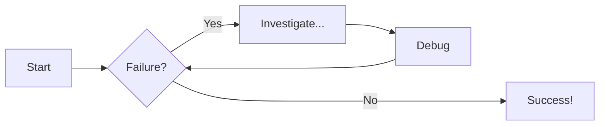

sadf
# Diagram Examples

## Flowcharts

zxc
dasdfkjs asdfj asdfjas dfasdf asdjf asdfja dfajldksf asdf asdfja sfjasdfl asdf adfkja sdf
asf
asdfsfdkljass
fasfja
gasd
asdfasdfj
asdfasjf
asdfjafdasdadsf
asd
fa
dfa
fdsfafadf asjfd asdfjadf ajdflkajd fakdfj adfjakdfja akj dfa
